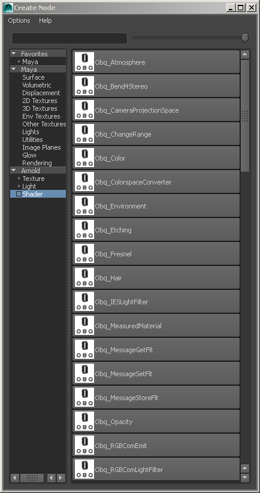

# Oblique Shaders for MtoA Dev Notes #

## How to Install ##

        + copy the content of the "metadata" folder into "C:\solidangle\mtoadeploy\<Maya Version>\shaders",[Windows]
        + copy the content of the "metadata" folder into "/opt/solidangle/mtoa/<Maya Version>/shaders/",[Linux]
        + copy the content of the "metadata" folder into "~/solidangle/mtoa/<Maya Version>/shaders/",[OSX]

        + copy the content of the "ae" folder into "C:\solidangle\mtoadeploy\<Maya Version>\scripts\mtoa\ui\ae",[Windows]
        + copy the content of the "ae" folder into "/opt/solidangle/mtoa/<Maya Version>/scripts/mtoa/ui/ae",[Linux]
        + copy the content of the "ae" folder into "~/solidangle/mtoa/<Maya Version>/scripts/mtoa/ui/ae",[OSX]

        + copy the content of the "icons" folder into "C:\solidangle\mtoadeploy\<Maya Version>\icons",[Windows]
        + copy the content of the "icons" folder into "/opt/solidangle/mtoa/<Maya Version/icons",[Linux]
        + copy the content of the "icons" folder into "~/solidangle/mtoa/<Maya Version/icons",[OSX]

		+ copy the content of the "attrPresets" folder into "C:\Users\<User Account>\Documents\maya\<Maya Version>\presets\attrPresets",[Windows]
		+ copy the content of the "attrPresets" folder into "/home/<User Account>/maya/<Maya Version>/presets/attrPresets",[Linux]
		+ copy the content of the "attrPresets" folder into "~/Library/Preferences/Autodesk/maya/<Maya Version>/presets/attrPresets",[OSX]

        + copy the .dll   in "bin" into "/opt/solidangle/mtoa/<Maya Version>/shaders",[Windows]
        + copy the .so    in "bin" into "/opt/solidangle/mtoa/<Maya Version>/shaders",[Linux]
        + copy the .dylib in "bin" into " ~/solidangle/mtoa/<Maya Version>/shaders",[OSX]


Windows requirements:  
[Microsoft Visual C++ 2010 redistributable package (x64)](http://www.microsoft.com/en-us/download/details.aspx?id=14632)

### How to use Obq_Simbiont ###

Copy the `bin\dte\dte_2600_64.dll` (DarkTree library) to either `C:\Windows` or another [Windows] arbitrary directory (AD). If you chose the AD method, you'll need to append this AD to the PATH environment variable. 

For example, you can add: `set PATH=%PATH%;\\serverX\dte_folder` in the .bat that launches Maya (without the quotes). You will also need copy the `\bin\dte\dte_components` folder somewhere and change the path on line 30 of the `Obq_SimbiontTemplate.py` (the `componentLibsPath` parameters).

If you don't own a copy of DarkTree, you can download some DarkTree files here:  
[http://www.darksim.com/html/downloads.html](http://www.darksim.com/html/downloads.html)
  

## OBQ Shaders in Maya ##

The easiest way to check if MtoA has loaded the Oblique shaders is by opening up Maya's `Create Node` window and clicking on the Arnold render node section on the left side of the window. If the OBQ shaders are visible in the list and they have a custom "OBQ" icon, then the shaders were installed correctly.



If MtoA has a problem loading the OBQ shaders you can check the Maya Script Editor window, and the Output window for more details.

## Version History ##

### 2015-03-01 Changes ###
- **[ACH]** Updated the metadata file and the ae template for the Obq_StereoLens shader in MtoA.

### 2015-03-01 Changes ###
- **[ACH]** Updated the metadata files to add a Houdini "OBQ Shaders" category, and improved the Houdini GUI labeling.

### 2015-01-26 Changes ###
- **[ACH]** Updated the metadata file to add a the attribute "is_perspective" to the lens shaders. This should help fix the Arnold "Not a perspective camera, cannot use view-dependent subdivision" error.	[https://trac.solidangle.com/mtoa/ticket/1646#comment:9](https://trac.solidangle.com/mtoa/ticket/1646#comment:9)

### 2014-12-02 Changes ###
- **[ACH]** Added a Maya attrPresets folder and ported the 42 `Obq_Fresnel` material presets from the `Obq_Fresnel.spdl` file into the Maya attribute editor "Presets" menu format.

### 2014-11-30 Changes ###
- **[ACH]** Updated the metadata file to add the new v303 shaders and fix indentation
- **[ACH]** Updated Obq Help links in ae template files  
- **[ACH]** Added new Maya Node IDs to Metadata files:
	- Obq_MessageSetFlt
	- Obq_MessageStoreFlt
	- Obq_SetAlpha
	- Obq_SpectrumColor
	- Obq_TransformShadingPoint
- **[ACH]** Created a new `Obq_ColorspaceConverter` ae template file  
- **[ACH]** Created a new `Obq_MessageSetFlt` ae template file  
- **[ACH]** Created a new `Obq_MessageStoreFlt` ae template file  
- **[ACH]** Renamed ae template file `Obq_MessageFltTemplate.py` to `Obq_MessageGetFltTemplate.py`
- **[ACH]** Updated `Obq_MessageGetFltTemplate.py` and mtd to change `message` attribute to `key`.
- **[ACH]** Updated `Obq_RandomColorTemplate.py` and mtd to add the `XtoA` attribute.
- **[ACH]** Updated `Obq_OpacityTemplate.py` and mtd to add the modified attributes.
- **[ACH]** Updated `Obq_FresnelTemplate.py` and mtd to add the modified attributes.

### 2014-10-19 Changes ###
- **[ACH]** Added ae templates for the following shaders:

	- Obq_CameraProjectionSpace
	- Obq_Color
	- Obq_Etching
	- Obq_Fresnel
	- Obq_MessageFlt
	- Obq_Opacity
	- Obq_RandomID
	- Obq_RayDepth

### 2014-09-11 Changes ###
- **[ACH]** Added the default shader settings to the Maya .mtd metadata file.
- **[ACH]** Added Obq_Simbiont ae template file.
- **[ACH]** Added OBQ_IESLightFilter ae template file.


### 2014-09-10 Changes ###
- **[ACH]** Added Maya files for:
	- Obq_Atmosphere
	- Obq_Bend4Stereo
	- Obq_ChangeRange
	- Obq_Environment
	- Obq_RandomColor
- **[ACH]** Updated the Obq_ToonSimple ae template


### 2014-09-08 Changes ###
- **[ACH]** Added custom Maya OBQ icons.
- **[ACH]** Renamed metadata file to match current shader DLL.

## Known Issues ##

### Obq_RandomColor ###
  With Strip Model Name and Strip Frame Number enabled and the new XtoA Software attribute set to MtoA I get the following error in Maya and MtoA Kick.exe:
  ```[Obq_RandomColor] : Couldn't find the frame number separator. Name is : pSphereShape22 and separator is .MtoA.```

### Obq_MeasuredMaterial ###
- Adding an Obq_MeasuredMaterial node to a Maya scene causes a crash. This might be caused by MtoA trying to render a preview swatch.

### Obq_ColorspaceConverterTemplate.py ###
- The ColorspaceIn and ColorspaceOut GUI elements haven't been implemented yet.

### Obq_StereoLens ###

The shader needs to be customized to work with Maya/MtoA's camera naming system.

## OBQ Lens Shaders ##

MtoA loads lens shaders in Maya using the ae template file's `templates.registerTranslatorUI` function. At this point in time there appears to be an issue where the `Obq_AngularCamera` and `Obq_StereoLens` shaders aren't listed in the CameraShape node's Arnold section. This is something that has to be explored further.

Also the current MtoA release's registerTranslatorUI function won't allow a 3rd party lens shader to be associated as both a "camera" and a "stereoRigCamera" object. This means that lens shader's won't be able to be added to the center camera view in a stereo camera rig.


## Missing AE Template Files ##

Several of the Obq shader's lack ae template files. The following ae template files need to be created:

- Obq_RGBComEmit
- Obq_RGBComLightFilter
- Obq_Root2Tip
- Obq_SetAlpha
- Obq_TransformUV
- Obq_SpectrumColor
- Obq_TransformShadingPoint
- Obq_VolumeThickness
- Obq_Hair
- Obq_SurfaceEnvironment
- Obq_Thickness
- Obq_Toon
- Obq_UVRemapLensDistortion
